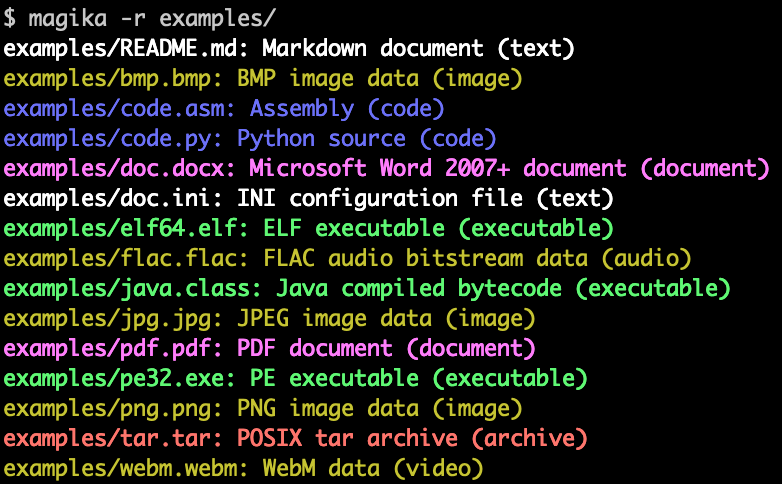

# Magika

[](https://pypi.python.org/pypi/magika)<!-- [](https://pypi.python.org/pypi/magika) -->
[](https://pypi.python.org/pypi/magika)
[](https://securityscorecards.dev/viewer/?uri=github.com/google/magika)
[](https://www.bestpractices.dev/en/projects/8706)

[](https://github.com/google/magika/actions)
[](https://pypi.org/project/magika/)

Magika is a novel AI powered file type detection tool that relies on the recent advance of deep learning to provide accurate detection. Under the hood, Magika employs a custom, highly optimized Keras model that only weighs about a few MBs, and enables precise file identification within milliseconds, even when running on a single CPU.

In an evaluation with over 1M files and over 100 content types (covering both binary and textual file formats), Magika achieves 99%+ precision and recall. Magika is used at scale to help improve Google users’ safety by routing Gmail, Drive, and Safe Browsing files to the proper security and content policy scanners.
Read more in our [research paper](https://arxiv.org/abs/2409.13768)!

You can try Magika without installing anything by using our [web demo](https://google.github.io/magika/), which runs locally in your browser!

Here is an example of what Magika command line output look like:
<p align="center">
    
</p>

For more context you can read our initial [announcement post on Google's OSS blog](https://opensource.googleblog.com/2024/02/magika-ai-powered-fast-and-efficient-file-type-identification.html)

## News

> [!IMPORTANT]
> We are about to release a number of new things, and they are ready for testing!
> - We uploaded to pypi a release candidate for v0.6.0 (e.g., [`magika 0.6.0rc3`](https://pypi.org/project/magika/0.6.0rc3/)), it's ready for testing! Please report any problems here: https://github.com/google/magika/issues/798. You can install the latest release candidate with `pip install --pre magika`.
> - A new ML model with support for [200+ content types](./assets/models/standard_v2_1/README.md).
> - A new CLI written in Rust. This will replace the previous CLI written in python. More information [here](./rust/cli/README.md). The Rust codebase can also be used for applications written in rust, see the [docs](https://docs.rs/magika/0.1.0-rc.1/magika/index.html).
> - Upcoming python package v0.6.0: this version ships the new model with support for 200+ content types, the CLI written in Rust (which replaces the old one written in python), and a revamped Python API with a few breaking changes, see the [docs](./python/README.md) and the [changelog](./python/CHANGELOG.md)!
> - If you need docs about the stable release, browse this repository at the latest stable tag, [here](https://github.com/google/magika/tree/python-v0.5.1).
> - The Magika paper was accepted at IEEE/ACM International Conference on Software Engineering (ICSE) 2025! Stay tuned!


## Highlights

- Available as a command line tool written in Rust, a Python API, a Rust API, and an experimental TFJS version (which powers our [web demo](https://google.github.io/magika/)).
- Trained on a dataset of over 25M files across more than 100 content types.
- On our evaluation, Magika achieves 99%+ average precision and recall, outperforming existing approaches.
- More than 200 content types (see [full list](./assets/models/standard_v2_1/README.md)).
- After the model is loaded (this is a one-off overhead), the inference time is about 5ms per file.
- Batching: You can pass to the command line and API multiple files at the same time, and Magika will use batching to speed up the inference time. You can invoke Magika with even thousands of files at the same time. You can also use `-r` for recursively scanning a directory.
- Near-constant inference time independently from the file size; Magika only uses a limited subset of the file's bytes.
- Magika uses a per-content-type threshold system that determines whether to "trust" the prediction for the model, or whether to return a generic label, such as "Generic text document" or "Unknown binary data".
- Support three different prediction modes, which tweak the tolerance to errors: `high-confidence`, `medium-confidence`, and `best-guess`.
- It's open source! (And more is yet to come.)

For more details, see the documentation for the [python package](./python/README.md) and for the [js package](./js/README.md) (dev [docs](./docs/js.md)).


## Table of Contents

1. [Getting Started](#getting-started)
    1. [Installation](#installation)
    1. [Running on Docker](#running-in-docker)
    1. [Usage](#usage)
        1. [Command line (written in Rust)](#command-line-written-in-rust)
        1. [Python API](#python-api)
        1. [Experimental TFJS model & npm package](#experimental-tfjs-model--npm-package)
1. [Development Setup](#development-setup)
1. [Important Documentation](#important-documentation)
1. [Known Limitations & Contributing](#known-limitations--contributing)
1. [Frequently Asked Questions](#frequently-asked-questions)
1. [Additional Resources](#additional-resources)
1. [Research Paper and Citation](#research-paper-and-citation)
1. [License](#license)
1. [Disclaimer](#disclaimer)


## Getting Started

### Installation

Magika is available as `magika` on PyPI:

```shell
$ pip install magika
```

If you intend to use Magika only as a command line, you may want to use `$ pipx install magika` instead.

If you want to test out the latest release candidate, you can install with `pip install --pre magika`.


### Running in Docker

```
git clone https://github.com/google/magika
cd magika/
docker build -t magika .
docker run -it --rm -v $(pwd):/magika magika -r /magika/tests_data
```

### Usage

#### Command line (written in Rust)

The new command line is written in Rust, and it is available in the `magika` python package.

Examples:

```shell
$ cd tests_data/basic && magika -r *
asm/code.asm: Assembly (code)
batch/simple.bat: DOS batch file (code)
c/code.c: C source (code)
css/code.css: CSS source (code)
csv/magika_test.csv: CSV document (code)
dockerfile/Dockerfile: Dockerfile (code)
docx/doc.docx: Microsoft Word 2007+ document (document)
epub/doc.epub: EPUB document (document)
epub/magika_test.epub: EPUB document (document)
flac/test.flac: FLAC audio bitstream data (audio)
handlebars/example.handlebars: Handlebars source (code)
html/doc.html: HTML document (code)
ini/doc.ini: INI configuration file (text)
javascript/code.js: JavaScript source (code)
jinja/example.j2: Jinja template (code)
jpeg/magika_test.jpg: JPEG image data (image)
json/doc.json: JSON document (code)
latex/sample.tex: LaTeX document (text)
makefile/simple.Makefile: Makefile source (code)
markdown/README.md: Markdown document (text)
[...]
```

```shell
$ magika ./tests_data/basic/python/code.py --json
[
  {
    "path": "./tests_data/basic/python/code.py",
    "result": {
      "status": "ok",
      "value": {
        "dl": {
          "description": "Python source",
          "extensions": [
            "py",
            "pyi"
          ],
          "group": "code",
          "is_text": true,
          "label": "python",
          "mime_type": "text/x-python"
        },
        "output": {
          "description": "Python source",
          "extensions": [
            "py",
            "pyi"
          ],
          "group": "code",
          "is_text": true,
          "label": "python",
          "mime_type": "text/x-python"
        },
        "score": 0.753000020980835
      }
    }
  }
]
```

```shell
$ cat doc.ini | magika -
-: INI configuration file (text)
```

```help
$ magika --help
Determines the content type of files with deep-learning

Usage: magika [OPTIONS] [PATH]...

Arguments:
  [PATH]...
          List of paths to the files to analyze.

          Use a dash (-) to read from standard input (can only be used once).

Options:
  -r, --recursive
          Identifies files within directories instead of identifying the directory itself

      --no-dereference
          Identifies symbolic links as is instead of identifying their content by following them

      --colors
          Prints with colors regardless of terminal support

      --no-colors
          Prints without colors regardless of terminal support

  -s, --output-score
          Prints the prediction score in addition to the content type

  -i, --mime-type
          Prints the MIME type instead of the content type description

  -l, --label
          Prints a simple label instead of the content type description

      --json
          Prints in JSON format

      --jsonl
          Prints in JSONL format

      --format <CUSTOM>
          Prints using a custom format (use --help for details).

          The following placeholders are supported:

            %p  The file path
            %l  The unique label identifying the content type
            %d  The description of the content type
            %g  The group of the content type
            %m  The MIME type of the content type
            %e  Possible file extensions for the content type
            %s  The score of the content type for the file
            %S  The score of the content type for the file in percent
            %b  The model output if overruled (empty otherwise)
            %%  A literal %

  -h, --help
          Print help (see a summary with '-h')

  -V, --version
          Print version
```

See [here](./rust/cli/README.md) for more detailed documentation.


#### Python API

Examples:

```python
>>> from magika import Magika
>>> m = Magika()
>>> res = m.identify_bytes(b"# Example\nThis is an example of markdown!")
>>> print(res.output.label)
markdown
```


See [python documentation](./python/README.md) for detailed documentation.


#### Experimental TFJS model & npm package

We also provide Magika as an experimental package for people interested in using in a web app.
Note that Magika JS implementation performance is significantly slower and you should expect to spend 100ms+ per file.

See [js documentation](./docs/js.md) for the details.


## Development Setup

See the "Development Setup" section in the [python docs](./python/README.md).


## Important Documentation

- [Documentation about the CLI](./docs/command_line_interface.md)
- [Documentation about the new Rust CLI](./rust/cli/README.md)
- [Documentation about the bindings for different languages](./docs/bindings.md)
- [List of supported content types (for v1, more to come).](./docs/supported_content_types_list.md)
- [List of supported content types for the new model](./assets/models/standard_v2_1/README.md)
- [Documentation on how to interpret Magika's output.](./docs/magika_output.md)
- [Frequently Asked Questions](./docs/faq.md)


## Known Limitations & Contributing

Magika significantly improves over the state of the art, but there's always room for improvement! More work can be done to increase detection accuracy, support for additional content types, bindings for more languages, etc.

This initial release is not targeting polyglot detection, and we're looking forward to seeing adversarial examples from the community.
We would also love to hear from the community about encountered problems, misdetections, features requests, need for support for additional content types, etc.

Check our open GitHub issues to see what is on our roadmap and please report misdetections or feature requests by either opening GitHub issues (preferred) or by emailing us at magika-dev@google.com.

**NOTE: Do NOT send reports about files that may contain PII, the report contains (a small) part of the file content!**

See [`CONTRIBUTING.md`](CONTRIBUTING.md) for details.


## Frequently Asked Questions

We have collected a number of FAQs [here](./docs/faq.md).


## Additional Resources

- [Google's OSS blog post](https://opensource.googleblog.com/2024/02/magika-ai-powered-fast-and-efficient-file-type-identification.html) about Magika announcement.
- Web demo: [web demo](https://google.github.io/magika/).


## Research Paper and Citation
We describe how we developed Magika and the choices we made in [our research paper](https://arxiv.org/abs/2409.13768).

If you use this software for your research, please cite it as:
```bibtex
@misc{magika,
      title={{Magika: AI-Powered Content-Type Detection}},
      author={{Fratantonio, Yanick and Invernizzi, Luca and Farah, Loua and Kurt, Thomas and Zhang, Marina and Albertini, Ange and Galilee, Francois and Metitieri, Giancarlo and Cretin, Julien and Petit-Bianco, Alexandre and Tao, David and Bursztein, Elie}},
      year={2024},
      eprint={2409.13768},
      archivePrefix={arXiv},
      primaryClass={cs.CR},
      url={https://arxiv.org/abs/2409.13768},
}
```

> [!NOTE]
> The Magika paper was accepted at IEEE/ACM International Conference on Software Engineering (ICSE) 2025!

## Security vulnerabilities
Please contact us directly at magika-dev@google.com

## License

Apache 2.0; see [`LICENSE`](LICENSE) for details.

## Disclaimer

This project is not an official Google project. It is not supported by
Google and Google specifically disclaims all warranties as to its quality,
merchantability, or fitness for a particular purpose.
