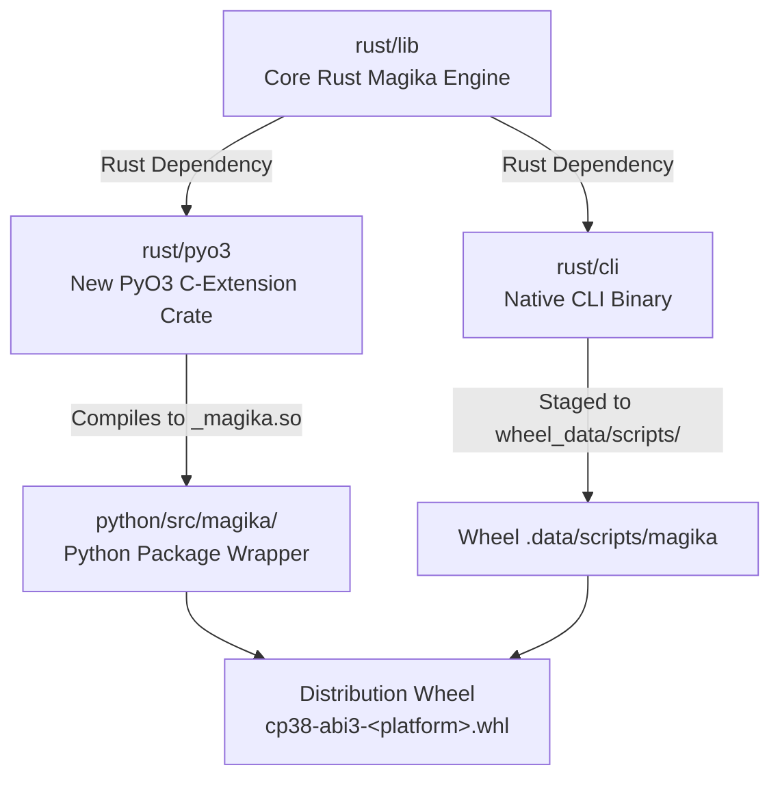

# Implementation Plan: PyO3 Bindings & Multi-Platform Wheel Distribution for Magika (POC)

## 1. Context & Objectives

Currently, Magika maintains two separate implementations:
- **Rust Core & CLI** (`rust/lib`, `rust/cli`): High-performance native library and standalone CLI using the `ort` Rust crate for ONNX inference.
- **Python Package** (`python/`): Pure-Python package that relies on the Python `onnxruntime` dependency (with complex version constraints across Python 3.8–3.14) and uses Maturin with `bindings = "bin"` solely to package the compiled Rust CLI executable.

### POC Objectives & Constraints
1. **Feasibility Proof (Not a Finished Product)**: The sole purpose is an exploratory feasibility study to determine whether bridging Magika's Rust core to Python and distributing multi-platform wheels is viable. Producing a polished, production-ready product is out of scope for this stage.
2. **Zero Backward Compatibility Constraints**: We explicitly do **not** care about backward compatibility in this POC branch. No legacy migration shims, deprecated config formats, or fallback wrappers should be implemented.
3. **Relaxed API Parity**: We do **not** require 100% API parity with the current Python package. We only need minimal viable surface area (e.g. core `identify_path` and `identify_bytes` calls) to prove that Python can load the extension and drive inference.
4. **Hybrid Distribution (Approach A)**: Package both the in-process PyO3 extension (`_magika.so` / `.pyd`) and the standalone native CLI binary (`magika`) into a single wheel.
5. **Stable ABI (`abi3`)**: Target `cp38-abi3` so a single wheel per platform serves all supported Python versions (3.8–3.14+).
6. **Isolated CI Matrix Validation**: Implement a dedicated GitHub Actions workflow to build and upload wheels as artifacts across all tier-1 platforms (Linux glibc/musl, macOS, Windows), temporarily ignoring/disabling unrelated existing release workflows.

---

## 2. Architecture & Codebase Layout



### Proposed Directory Additions & Modifications
- **`rust/pyo3/`** (New crate): PyO3 extension module exposing `rust/lib` to Python.
- **`python/src/magika/`**: Refactored to delegate inference to `_magika` while maintaining the public `Magika` Python class API.
- **`python/pyproject.toml`**: Switch from `bindings = "bin"` to PyO3 extension mode with `data = "wheel_data"`. Remove Python `onnxruntime` dependencies.
- **`python/wheel_data/scripts/`**: Staging directory for pre-compiled native `magika` CLI binary.
- **`.github/workflows/poc-pyo3-wheels.yml`** (New workflow): Isolated CI pipeline to build and validate the wheel matrix.

---

## 3. Phase 1: PyO3 Binding Layer (`rust/pyo3`)

### 3.1 Crate Setup
Create `rust/pyo3/Cargo.toml`:
```toml
[package]
name = "magika-pyo3"
version = "1.1.1-dev"
edition = "2021"
publish = false

[lib]
name = "_magika"
crate-type = ["cdylib"]

[dependencies]
magika = { path = "../lib" }
pyo3 = { version = "0.23", features = ["abi3-py38", "extension-module"] }
```

### 3.2 Core Rust Bridge (`rust/pyo3/src/lib.rs`)
Expose the minimal surface area needed by Python:
- **`PyMagika`**: Wraps `std::sync::Mutex<magika::Session>` (or equivalent synchronization) so methods can take `&self` while `Session::identify_*_sync(&mut self)` requires mutable access.
- **`identify_path(path: &str)`**: Releases Python GIL via `py.allow_threads` during file I/O and neural network inference. Returns `PyMagikaResult`.
- **`identify_bytes(data: &[u8])`**: Releases GIL during inference on in-memory buffers. Returns `PyMagikaResult`.
- **`PyMagikaResult`**: Exposes `label`, `mime_type`, `description`, and `score` as Python properties.
- **Error Handling**: Map `magika::Error` to Python `ValueError` or custom `MagikaError`.

---

## 4. Phase 2: Python Package Adaptation (`python/`)

### 4.1 Update `python/pyproject.toml`
Switch Maturin configuration from binary-only mode to PyO3 extension + staged binary:
```toml
[build-system]
requires = ["maturin>=1.5,<2.0"]
build-backend = "maturin"

[project]
name = "magika"
# Remove Python onnxruntime dependencies entirely
dependencies = [
    "click>=8.1.7",
]

[tool.maturin]
python-source = "src"
module-name = "magika._magika"
manifest-path = "../rust/pyo3/Cargo.toml"
data = "wheel_data"
```

### 4.2 Python Wrapper Layer
- In `python/src/magika/__init__.py`: Import `_magika` and wrap it with high-level conveniences (pathlib support, typing stubs).
- Preserve existing public API signatures (`identify_path`, `identify_paths`, `identify_bytes`).
- Add `_magika.pyi` and `py.typed` to ensure full type checker compliance (`mypy`, `pyright`).

---

## 5. Phase 3: Approach A Staging Pipeline (Local Verification)

Create a local build script `python/scripts/build_wheel.sh` to validate the hybrid bundling process:

```bash
#!/bin/bash
set -euo pipefail

ROOT_DIR=$(cd -- "$(dirname -- "${BASH_SOURCE[0]}")/../.." &>/dev/null && pwd)
cd "$ROOT_DIR"

# 1. Compile native CLI binary in release mode
# Note: .cargo/config.toml configures target-dir = "rust/target"
cargo build --release --manifest-path rust/cli/Cargo.toml

# 2. Stage binary into wheel_data/scripts/
mkdir -p python/wheel_data/scripts
cp rust/target/release/magika python/wheel_data/scripts/magika
chmod +x python/wheel_data/scripts/magika

# 3. Build wheel via maturin / uv
cd python
maturin build --release
```

---

## 6. Phase 4: GitHub Actions CI Wheel Matrix Workflow

Create `.github/workflows/poc-pyo3-wheels.yml` to validate multi-platform build feasibility. Existing workflows are left untouched or disabled during the branch investigation.

### 6.1 Matrix Specification

| Target Identifier | OS Runner | Architecture | Libc / ABI | Support Tier | Platform Tag |
| :--- | :--- | :--- | :--- | :--- | :--- |
| `x86_64-unknown-linux-gnu` | `ubuntu-latest` | x86_64 | glibc ($\ge$ 2.28) | **Tier 1** (Static ONNX via `maturin.sh`) | `manylinux_2_28_x86_64` |
| `aarch64-apple-darwin` | `macos-14` | Apple Silicon | macOS ($\ge$ 11.0) | **Tier 1** (Official `ort` prebuilt) | `macosx_11_0_arm64` |
| `x86_64-apple-darwin` | `macos-13` | Intel | macOS ($\ge$ 10.12) | **Tier 1** (Official `ort` prebuilt) | `macosx_10_12_x86_64` |
| `x86_64-pc-windows-msvc` | `windows-latest`| x86_64 | MSVC CRT | **Tier 1** (Official `ort` prebuilt) | `win_amd64` |
| `aarch64-unknown-linux-gnu`| `ubuntu-latest` | aarch64 | glibc ($\ge$ 2.28) | **Tier 2** (Cross-compile / QEMU) | `manylinux_2_28_aarch64` |
| `x86_64-unknown-linux-musl`| `ubuntu-latest` | x86_64 | musl ($\ge$ 1.2) | **Stretch** (No official `ort` prebuilts; validates future engine) | `musllinux_1_2_x86_64` |
| `aarch64-unknown-linux-musl`| `ubuntu-latest`| aarch64 | musl ($\ge$ 1.2) | **Stretch** (No official `ort` prebuilts; validates future engine) | `musllinux_1_2_aarch64` |
| `aarch64-pc-windows-msvc`| `windows-latest`| ARM64 | MSVC CRT | **Stretch** (No official `ort` prebuilts; validates future engine) | `win_arm64` |

> [!NOTE]
> For the initial POC validation, focus on the **Tier 1** targets to confirm PyO3 feasibility. Stretch targets (musl and Windows ARM64) stress-test ONNX Runtime linking gaps and will fully unlock once the native inference engine replacement lands.

### 6.2 Workflow Structure (`poc-pyo3-wheels.yml`)

```yaml
name: POC - PyO3 Multi-Platform Wheels

on:
  workflow_dispatch:
  push:
    branches:
      - "pyo3"
      - "poc-pyo3"

permissions:
  contents: read

jobs:
  build-wheels:
    name: Build wheel on ${{ matrix.platform.os }} (${{ matrix.platform.target }})
    runs-on: ${{ matrix.platform.runner }}
    strategy:
      fail-fast: false
      matrix:
        platform:
          - os: Linux
            runner: ubuntu-latest
            target: x86_64-unknown-linux-gnu
            manylinux: 2_28
            before-script-linux: "rust/onnx/maturin.sh"
          - os: macOS
            runner: macos-14
            target: aarch64-apple-darwin
          - os: macOS
            runner: macos-13
            target: x86_64-apple-darwin
          - os: Windows
            runner: windows-latest
            target: x86_64-pc-windows-msvc
          # --- Stretch targets (mental note: re-enable once native engine replaces ort) ---
          # - os: Linux
          #   runner: ubuntu-latest
          #   target: aarch64-unknown-linux-gnu
          #   manylinux: 2_28
          # - os: Linux (Alpine)
          #   runner: ubuntu-latest
          #   target: x86_64-unknown-linux-musl
          #   manylinux: musllinux_1_2
          # - os: Linux (Alpine)
          #   runner: ubuntu-latest
          #   target: aarch64-unknown-linux-musl
          #   manylinux: musllinux_1_2
          # - os: Windows
          #   runner: windows-latest
          #   target: aarch64-pc-windows-msvc

    steps:
      - uses: actions/checkout@v4

      - name: Setup Rust
        uses: dtolnay/rust-toolchain@stable
        with:
          targets: ${{ matrix.platform.target }}

      # Cache ONNX Runtime build on Linux
      - if: matrix.platform.runner == 'ubuntu-latest'
        uses: actions/cache@v4
        with:
          path: rust/onnx/runtime/build/Linux
          key: maturin-${{ matrix.platform.target }}-${{ hashFiles('rust/onnx/build.sh') }}

      # On non-Linux runners, compile and stage the CLI binary on the host
      - if: matrix.platform.runner != 'ubuntu-latest'
        name: Build and stage magika-cli (macOS/Windows)
        shell: bash
        run: |
          cargo build --release --manifest-path rust/cli/Cargo.toml --target ${{ matrix.platform.target }}
          mkdir -p python/wheel_data/scripts
          if [[ "${{ matrix.platform.target }}" == *"windows"* ]]; then
            cp rust/target/${{ matrix.platform.target }}/release/magika.exe python/wheel_data/scripts/
          else
            cp rust/target/${{ matrix.platform.target }}/release/magika python/wheel_data/scripts/
            chmod +x python/wheel_data/scripts/magika
          fi

      # Build PyO3 wheel using maturin-action
      # Note: On Linux, before-script-linux compiles ONNX static lib and stages magika-cli inside manylinux
      - name: Build wheel via Maturin
        uses: PyO3/maturin-action@v1
        with:
          target: ${{ matrix.platform.target }}
          args: --release --out dist
          manylinux: ${{ matrix.platform.manylinux || 'off' }}
          before-script-linux: ${{ matrix.platform.before-script-linux || '' }}
          working-directory: python

      - name: Upload wheel artifact
        uses: actions/upload-artifact@v4
        with:
          name: wheel-${{ matrix.platform.target }}
          path: python/dist/*.whl
```

---

## 7. Key Feasibility Risks & Mitigation

1. **ONNX Runtime Linking (`ort` crate)**:
   - *Current Status & Plan*: A parallel effort by colleagues is actively working toward removing the `ort` dependency entirely in favor of a simpler, lighter native inference engine. For this POC, however, **we keep `ort` in place** to determine whether the existing stack can link, vendor, and distribute across the entire matrix.
   - *Risk*: `ort` dynamically links to `libonnxruntime.so` (or downloads pre-compiled shared libraries) that Maturin's auditwheel logic must inspect, vendor into `magika.libs/`, and patch with RPATH.
   - *POC Value*: Testing with `ort` now stress-tests the most complex linking scenario (especially on Alpine/musl and ARM64). Any hurdles encountered will inform the ongoing inference engine redesign, and removing `ort` later will only simplify the final build.
   - *Mitigation*: Ensure `ort` features (`load-dynamic` vs `download-binaries`) align with Maturin's bundling mechanism. Verify vendored libraries with `unzip -l` and test in pristine containers.
2. **Binary Staging vs Cross-Compilation**:
   - *Risk*: Staging `target/<triple>/release/magika` requires that the CLI binary is cross-compiled for the same target as the PyO3 module before Maturin packages the wheel.
   - *Mitigation*: Handled explicitly in the workflow step prior to `maturin-action`.
3. **ABI3 Constraints**:
   - *Risk*: Accidentally calling non-Limited C-API functions in PyO3.
   - *Mitigation*: Enforce `features = ["abi3-py38", "extension-module"]` in `rust/pyo3/Cargo.toml`.

---

## 8. Verification & Acceptance Checklist

- [ ] **Artifact Generation**: All 8 target wheels are successfully produced and uploaded as GitHub Actions artifacts.
- [ ] **Wheel Tagging**: Generated wheels carry `cp38-abi3` and appropriate platform tags (`manylinux_2_28`, `musllinux_1_2`, `macosx_11_0`, `win_amd64`).
- [ ] **Dual-Entrypoint Inspection**:
  - `unzip -l <wheel>.whl` contains both `magika.data/scripts/magika` and `magika/_magika.*.so`.
- [ ] **Runtime Validation**:
  - `pip install <wheel>.whl` on a clean machine executes `magika --version` without invoking Python.
  - `python -c "import magika; m = magika.Magika(); print(m.identify_bytes(b'%PDF-1.4'))"` executes inference at native Rust speed without Python `onnxruntime` installed.
- [ ] **Forward Compatibility**: The same `cp38-abi3` wheel installs and passes smoke tests on Python 3.8, 3.12, 3.13, and 3.14.
